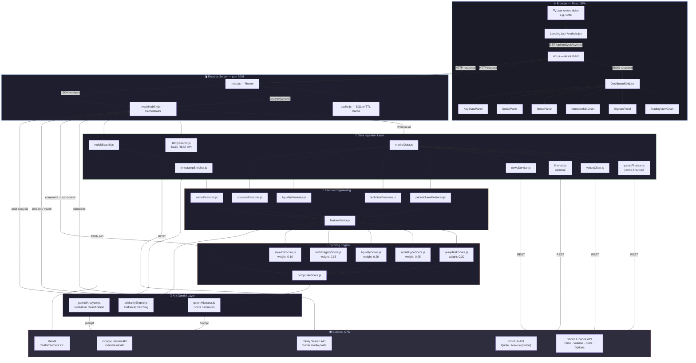

<p align="center">
  
</p>

<h3 align="center"><em>Investor protection through suspicious behavior screening</em></h3>

<p align="center">
  
  
  
  
  
  
  
</p>

---

## 📰 Background: The Impact of Market Manipulation

Market manipulation is not a victimless crime. It erodes the foundational trust that financial markets depend on to function efficiently, and its consequences ripple far beyond the trading floor.

### 💰 Real-World Damage

- **Retail investors lose billions annually** to pump-and-dump schemes, where coordinated social media campaigns inflate stock prices before insiders sell off, leaving ordinary investors holding worthless shares. The U.S. Securities and Exchange Commission estimates that microcap fraud alone costs investors **$3–5 billion per year**.

- **The GameStop saga (January 2021)** demonstrated how social media-driven momentum on platforms like Reddit's r/WallStreetBets can create extreme volatility. While some profited, many retail investors who bought at the peak lost **over 80% of their investment** within weeks.

- **Cryptocurrency pump-and-dump schemes** have become rampant, with researchers at the University of Texas finding that **80%+ of ICOs in 2017–2018** showed signs of manipulation, resulting in estimated losses exceeding **$1 billion**.

- **Confidence erosion**: A CFA Institute survey found that **56% of retail investors** believe markets are rigged against them, leading to reduced market participation and a widening wealth gap.

### 🎯 Why Detection Matters

Traditional manipulation detection relies on regulatory bodies with limited resources. By the time enforcement actions are taken, the damage is already done. **Real-time, AI-powered screening tools** like Sussy Scanner aim to give everyday investors the ability to see the same red flags that institutional risk managers monitor, before they become casualties.

> *"Sunlight is said to be the best of disinfectants."* — Louis Brandeis, U.S. Supreme Court Justice

---

## 🚀 What Is Sussy Scanner?

**Sussy Scanner** is a full-stack market manipulation detector that cross-references **real-time stock data** with **social media activity** to flag suspicious behavior patterns. Built for the **Hack Brooklyn** hackathon, it combines multi-source data ingestion, statistical feature engineering, and Google Gemini–powered AI analysis to produce an explainable, composite risk score for any publicly traded stock.

### ✨ Key Features

| Feature | Description |
|---------|-------------|
| 📊 **Multi-Score Risk Engine** | Five independent sub-scores (Pump Risk, Social Hype, Liquidity Stress, Technical Fragility, Squeeze Pressure) combined into a weighted composite |
| 🤖 **AI-Powered Analysis** | Google Gemini analyzes social media posts for promotional language, hype signals, and coordinated campaigns |
| 📈 **Interactive Charts** | TradingView lightweight charts for candlestick/line visualization + Recharts for risk signals and narrative breakdowns |
| 🔍 **Similarity Engine** | Compares current stock behavior against a database of known historical pump events (GME, AMC, DWAC, BBBY, SMCI) |
| 🧠 **Explainable Scoring** | Every score includes top contributing features and AI-generated natural language narratives |
| 📰 **News Cross-Referencing** | Checks whether price moves are backed by credible news or appear "unexplained" |
| 💬 **Social Media Aggregation** | Aggregates posts from multiple sources (Tavily search, Reddit) with sentiment and hype classification |
| ⏱️ **Smart Caching** | SQLite-backed caching layer with TTL to avoid redundant API calls and speed up repeat analyses |
| 🗂️ **Preset Historical Events** | One-click analysis of famous manipulation events (GameStop squeeze, AMC rally, Trump SPAC, etc.) |

---

## 🏗️ Architecture

The following diagram traces the complete data flow from the moment a user enters a stock ticker to the final rendered analysis dashboard:



---

## 📐 Scoring Methodology

The composite manipulation risk score is a **weighted average of five independent sub-scores**, each ranging from 0–100:

```
┌──────────────────────┬────────┬───────────────────────────────────────────┐
│ Sub-Score            │ Weight │ Key Features                              │
├──────────────────────┼────────┼───────────────────────────────────────────┤
│ 🔴 Pump Risk         │  30%   │ Volume z-scores, price gaps, ROC accel.   │
│ 🟠 Social Hype       │  25%   │ Mention velocity, hype score, spam ratio  │
│ 🔵 Liquidity Stress  │  20%   │ Float, ADV, market cap, inst. ownership   │
│ 🟡 Technical Fragility│  15%   │ RSI, SMA distance, Bollinger breaches     │
│ 🟣 Squeeze Pressure  │  10%   │ Short % float, days-to-cover, P/C ratio   │
└──────────────────────┴────────┴───────────────────────────────────────────┘
```

### Risk Bands

| Band | Score Range | Color |
|------|------------|-------|
| 🟢 LOW | 0–25 | Green |
| 🟡 MEDIUM | 25–50 | Yellow |
| 🟠 HIGH | 50–75 | Orange |
| 🔴 CRITICAL | 75–100 | Red |

The composite applies a **stacking floor** (when 2+ sub-scores are HIGH, the composite can't fall below their average) and a **correlation cap** (no single outlier can push the composite more than 15 points above the max sub-score) to prevent dilution or exaggeration.

---

## 🛠️ Tech Stack

### Frontend
<p>
  
  
  
  
  
  
</p>

### Backend
<p>
  
  
  
  
  
</p>

### Data Sources & AI
<p>
  
  
  
  
</p>

---

## 📁 Project Structure

```
sussy-scanner/
├── 📂 client/                          # React + Vite frontend
│   ├── src/
│   │   ├── components/
│   │   │   ├── AnalysisHeader.jsx      # Symbol, date, score badge
│   │   │   ├── DashboardGrid.jsx       # Main analysis layout
│   │   │   ├── TradingViewChart.jsx    # Candlestick / line chart
│   │   │   ├── SignalsPanel.jsx        # Expandable risk scores
│   │   │   ├── NarrativeMixChart.jsx   # Social narrative donut
│   │   │   ├── SocialPanel.jsx         # Social media posts feed
│   │   │   ├── NewsPanel.jsx           # News articles panel
│   │   │   ├── KeyStatsPanel.jsx       # Feature value table
│   │   │   ├── ScoreCard.jsx           # Individual score display
│   │   │   ├── SimilarityCallout.jsx   # Historical match display
│   │   │   └── ...
│   │   ├── routes/
│   │   │   ├── Landing.jsx             # Home page with search
│   │   │   └── Analysis.jsx            # Analysis dashboard
│   │   ├── services/
│   │   │   └── api.js                  # Axios API client
│   │   └── styles/
│   │       └── tokens.css              # Design tokens
│   └── package.json
│
├── 📂 server/                          # Express backend
│   ├── index.js                        # App entry + route definitions
│   ├── db.js                           # SQLite connection
│   │
│   ├── 📂 ingestion/                   # Data source adapters
│   │   ├── marketData.js               # Unified market data facade
│   │   ├── yahooFinance.js             # Yahoo Finance quote/stats
│   │   ├── yahooChart.js               # Yahoo Finance OHLCV history
│   │   ├── finnhub.js                  # Finnhub quote/news adapter
│   │   ├── newsService.js              # News aggregation
│   │   ├── tavilySearch.js             # Tavily social media search
│   │   ├── redditSearch.js             # Reddit post search
│   │   └── timestampEnricher.js        # Post timestamp normalization
│   │
│   ├── 📂 features/                    # Feature engineering modules
│   │   ├── featureVector.js            # Feature assembly + ordering
│   │   ├── priceVolumeFeatures.js      # Volume z-scores, returns
│   │   ├── technicalFeatures.js        # RSI, SMA, Bollinger Bands
│   │   ├── liquidityFeatures.js        # Float, ADV, market cap
│   │   ├── squeezeFeatures.js          # Short interest, options
│   │   ├── socialFeatures.js           # Mentions, hype, sentiment
│   │   └── stats.js                    # Statistical helpers
│   │
│   ├── 📂 services/                    # Business logic
│   │   ├── explainability.js           # Main analysis orchestrator
│   │   ├── compositeScore.js           # Weighted score aggregation
│   │   ├── pumpRiskScore.js            # Pump & dump detection
│   │   ├── socialHypeScore.js          # Social media hype scoring
│   │   ├── liquidityScore.js           # Liquidity stress scoring
│   │   ├── techFragilityScore.js       # Technical fragility scoring
│   │   ├── squeezeScore.js             # Short squeeze scoring
│   │   ├── scoringHelpers.js           # Severity + band utilities
│   │   ├── geminiClient.js             # Gemini API client
│   │   ├── geminiAnalyzer.js           # AI post classification
│   │   ├── geminiNarrator.js           # AI narrative generation
│   │   ├── similarityEngine.js         # Historical event matching
│   │   └── cache.js                    # SQLite TTL cache
│   │
│   ├── 📂 data/                        # Reference datasets
│   │   ├── pump_anchors.json           # Known pump event features
│   │   └── preset_squeeze.json         # Preset analysis events
│   │
│   └── package.json
│
├── .env.example                        # Environment template
└── package.json                        # Root workspace config
```

---

## ⚡ Quick Start

### Prerequisites

- **Node.js** ≥ 18
- **npm** ≥ 9
- API keys for:
  - [Tavily](https://tavily.com/) (required — social media search)
  - [Google AI Studio](https://aistudio.google.com/) (required — Gemini API)
  - [Finnhub](https://finnhub.io/) (optional — enhanced market data)

### Installation

```bash
# 1. Clone the repository
git clone <repo-url>
cd "Hack Brooklyn"

# 2. Install all dependencies (root + server + client)
npm run install:all

# 3. Configure environment variables
cp .env.example .env
# Edit .env with your API keys

# 4. Start development servers (both client + server)
npm run dev
```

The app will be available at:
- 🖥️ **Frontend**: `http://localhost:5173` (Vite dev server)
- ⚙️ **Backend**: `http://localhost:3001` (Express API)

### Environment Variables

| Variable | Required | Description |
|----------|----------|-------------|
| `TAVILY_API_KEY` | ✅ | Tavily search API key for social media ingestion |
| `GEMINI_API_KEY` | ✅ | Google AI Studio API key for Gemini/Gemma model |
| `GEMINI_MODEL` | ❌ | Model ID (default: `gemma-3-27b-it`) |
| `FINNHUB_API_KEY` | ❌ | Finnhub API key for enhanced market data |
| `PORT` | ❌ | Server port (default: `3001`) |
| `CACHE_DB_PATH` | ❌ | SQLite cache path (default: `./cache.sqlite`) |

---

## 🔌 API Reference

### Core Endpoints

| Method | Endpoint | Description |
|--------|----------|-------------|
| `GET` | `/api/health` | Health check + model info |
| `GET` | `/api/analysis/:symbol` | 🔥 **Full analysis** — scores, features, AI narratives, similarity |
| `GET` | `/api/similarity/:symbol` | Historical pump event similarity match |
| `GET` | `/api/timeline/:symbol` | Price + volume + social velocity time series |
| `GET` | `/api/presets` | List of preset historical events |

### Market Data

| Method | Endpoint | Description |
|--------|----------|-------------|
| `GET` | `/api/stock/quote/:symbol` | Real-time quote |
| `GET` | `/api/stock/history/:symbol` | OHLCV history (`?period1=&period2=&interval=1d`) |
| `GET` | `/api/stock/stats/:symbol` | Key statistics (market cap, float, etc.) |
| `GET` | `/api/stock/search?q=` | Symbol search / autocomplete |

### Social & News

| Method | Endpoint | Description |
|--------|----------|-------------|
| `GET` | `/api/social/:symbol` | Social media posts (`?date=&window=7`) |
| `GET` | `/api/news/:symbol` | News articles (`?date=&window=7`) |

All endpoints support an optional `date` query parameter for historical analysis (e.g., `?date=2021-01-27`).

---

## 🧪 Preset Historical Events

The app ships with pre-configured famous market events for instant analysis:

| Ticker | Date | Event |
|--------|------|-------|
| 🎮 **GME** | 2021-01-27 | GameStop short squeeze |
| 🎬 **AMC** | 2021-06-02 | AMC ape rally |
| 🏛️ **DWAC** | 2021-10-22 | Trump SPAC pump |
| 🛏️ **BBBY** | 2022-08-16 | Bed Bath & Beyond meme revival |
| 💻 **SMCI** | 2024-03-08 | Super Micro AI spike |

---

## 🧠 How the AI Analysis Works

1. **Social Post Collection** — Tavily and Reddit APIs gather recent social media posts mentioning the stock
2. **Pre-filtering** — Posts are pre-screened using regex patterns for clearly benign (earnings, SEC filings) or clearly suspicious ("to the moon", "diamond hands") language
3. **Gemini Batch Analysis** — Remaining posts are sent to Google Gemini in batches of 5, classified for:
   - Promotional language detection
   - Hype score (0–1)
   - Urgency signals
   - Sentiment (bullish/bearish/neutral)
   - Narrative categorization (meme_hype, short_squeeze, coordination_signal, etc.)
4. **Narrative Generation** — Gemini generates one-line explanations for each risk sub-score
5. **Similarity Matching** — The assembled feature vector is compared against known historical pump events using cosine similarity

---

This project was built for **Hack Brooklyn** and is intended for educational and research purposes. Market data is sourced from public APIs; this tool does not constitute financial advice.

---

<p align="center">
  <strong>Built with 🔍 by the Sussy Scanner team @ Hack Brooklyn</strong>
</p>
